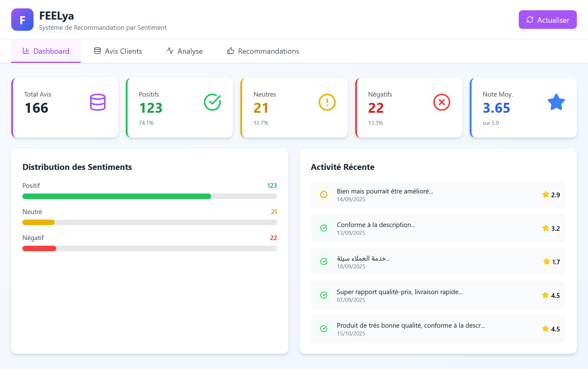
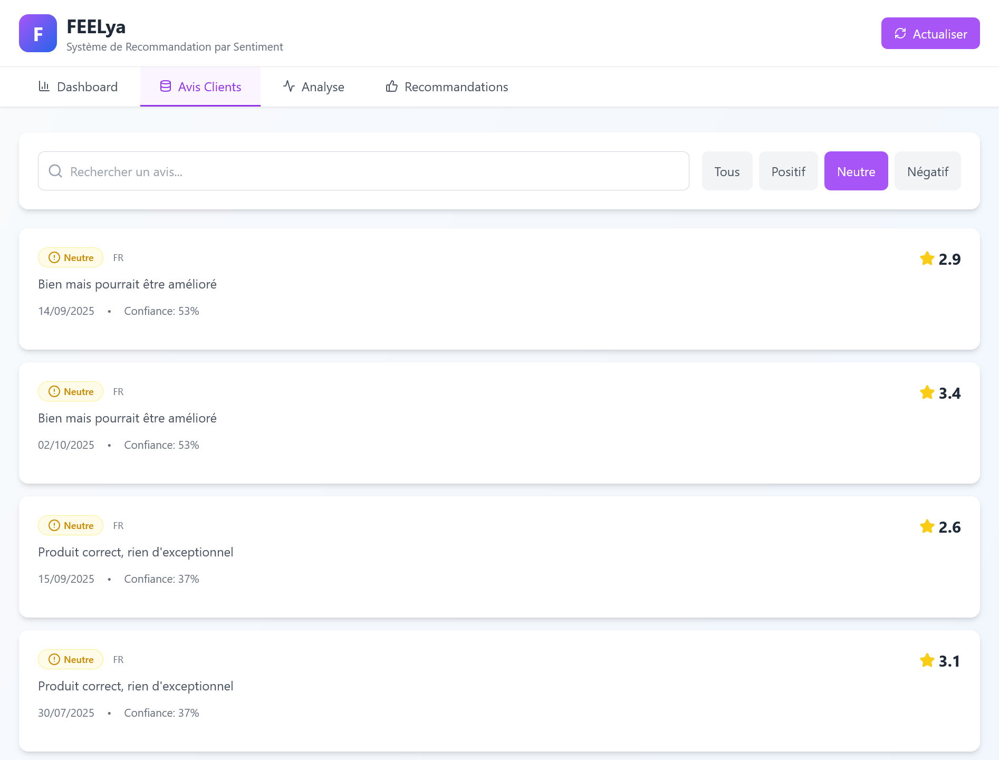
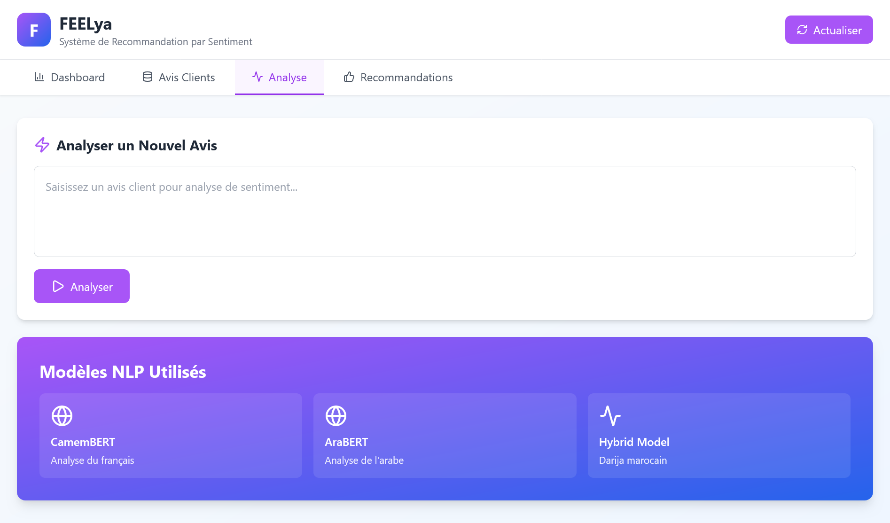
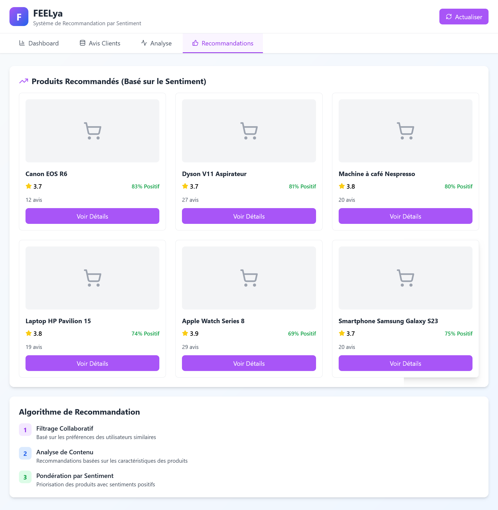

# 🤖💜 FEELya - Plateforme d'Analyse de Sentiment Intelligent

**On sent ce que tu ressens** 🇲🇦

## 🎯 Présentation

FEELya est une plateforme SaaS innovante d'analyse de sentiment et de recommandation intelligente, spécialement conçue pour le marché e-commerce marocain. Notre solution utilise l'IA et le NLP multilingue pour comprendre les émotions des clients et générer des recommandations personnalisées.


*Capture du dashboard principal*


*Capture des avis clients*


*Capture de l'interface Analyse des Sentiments*


*Capture de l'interface recommendations*

### ✨ Fonctionnalités Principales

- `🔍` **Analyse de Sentiment Multilingue** - Support du Français, Darija et Arabe
- `🎯` **Recommandations Intelligentes** - Algorithmes basés sur l'émotion client
- `📊` **Dashboard Temps Réel** - Visualisation des insights clients
- `🤖` **IA Adaptative** - Modèles NLP fine-tunés pour le contexte marocain
- `🚀` **API RESTful** - Intégration facile avec vos systèmes existants

## 🚀 Installation et Démarrage

### Créer un environnement virtuel
```bash
python -m venv venv
source venv/bin/activate  # Linux/Mac
# ou
venv\\Scripts\\activate  # Windows
```

### Installer les dépendances
```bash
pip install -r requirements.txt
```

### Configuration
```bash
cp .env.example .env
# Éditer .env avec vos paramètres
```

### Lancer l'application
```bash
uvicorn main:app --reload
```

L'API sera disponible sur: http://localhost:8000
Documentation: http://localhost:8000/docs

## Avec Docker

```bash
docker-compose up -d
```

## Endpoints API

### Avis (Reviews)
- `POST /api/v1/reviews/` - Créer un avis
- `GET /api/v1/reviews/` - Récupérer les avis

### Analyse de sentiment
- `POST /api/v1/analyze-sentiment/` - Analyser un texte

### Produits
- `GET /api/v1/products/` - Liste des produits
- `GET /api/v1/products/{id}` - Détails d'un produit

### Recommandations
- `GET /api/v1/recommendations/hybrid/{user_id}` - Recommandations hybrides
- `GET /api/v1/recommendations/trending/` - Produits tendance

### Statistiques
- `GET /api/v1/stats/dashboard/` - Stats du dashboard

## 🏗️ Architecture

1. **Collecte**: Web scraping des avis clients
2. **Prétraitement**: Nettoyage et normalisation (FR/AR/Darija)
3. **Analyse**: Détection de sentiment avec BERT multilingue
4. **Recommandation**: Algorithme hybride (collaboratif + contenu + sentiment)

## Technologies

- **Backend**: FastAPI, SQLAlchemy
- **ML/NLP**: Transformers, PyTorch, scikit-learn
- **Base de données**: PostgreSQL
- **Frontend**: React (voir dossier frontend/)

## Licence

MIT License

print("""
╔══════════════════════════════════════════════════════════════╗
║                                                              ║
║  ███████╗███████╗███████╗██╗  ██╗   ██╗ █████╗              ║
║  ██╔════╝██╔════╝██╔════╝██║  ╚██╗ ██╔╝██╔══██╗             ║
║  █████╗  █████╗  █████╗  ██║   ╚████╔╝ ███████║             ║
║  ██╔══╝  ██╔══╝  ██╔══╝  ██║    ╚██╔╝  ██╔══██║             ║
║  ██║     ███████╗███████╗███████╗██║   ██║  ██║             ║
║  ╚═╝     ╚══════╝╚══════╝╚══════╝╚═╝   ╚═╝  ╚═╝             ║
║                                                              ║
║  Système de Recommandation par Sentiment                    ║
║  pour E-commerce Marocain                                   ║
║                                                              ║
║  ✅ Code backend complet                                     ║
║  ✅ Interface React intégrée                                 ║
║  ✅ Analyse de sentiment multilingue (FR/AR/Darija)         ║
║  ✅ Système de recommandation hybride                        ║
║  ✅ API REST complète                                        ║
║                                                              ║
╚══════════════════════════════════════════════════════════════╝

📦 Structure du projet créée avec succès!

🚀 Pour démarrer:
   1. Installer les dépendances: pip install -r requirements.txt
   2. Configurer .env
   3. Initialiser la DB
   4. Lancer: uvicorn main:app --reload

📖 Documentation API: http://localhost:8000/docs
🎨 Interface: Voir l'artifact React

💡 Fonctionnalités:
   ✓ Web scraping (Jumia, Hmizate)
   ✓ Prétraitement multilingue
   ✓ Analyse de sentiment (CamemBERT/AraBERT)
   ✓ Recommandations personnalisées
   ✓ Dashboard temps réel
   ✓ API RESTful complète

🔧 Prochaines étapes:
   - Fine-tuning des modèles sur données marocaines
   - Optimisation des performances
   - Tests unitaires et d'intégration
   - Déploiement production

""")